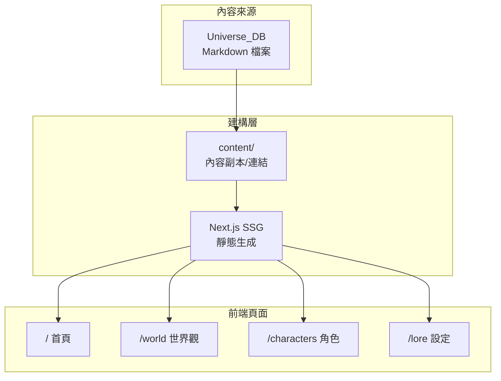

# 系統架構

## 架構概覽



## 頁面路由

| 路徑 | 頁面 | 說明 |
|------|------|------|
| `/` | 首頁 | 宣傳風格首頁 |
| `/world` | 世界觀 | 地圖與區域介紹 |
| `/characters` | 角色列表 | 角色卡片牆 |
| `/characters/[slug]` | 角色詳情 | 單一角色頁面 |
| `/lore` | 設定文庫 | 詳細設定列表 |
| `/about` | 關於 | 作者資訊 |

## 元件結構

```
components/
├── ui/                     # 基礎 UI 元件
│   ├── Button.tsx
│   ├── Card.tsx
│   └── Modal.tsx
├── layout/                 # 版面元件
│   ├── Header.tsx
│   ├── Footer.tsx
│   └── Navigation.tsx
└── features/               # 功能元件
    ├── CharacterCard.tsx
    ├── WorldMap.tsx
    └── Timeline.tsx
```

## 資料流

1. **內容來源**: `Universe_DB` 的 Markdown 檔案
2. **建構時期**: Next.js 讀取並解析內容
3. **靜態生成**: 產生 HTML 頁面
4. **部署**: 上傳至 Vercel CDN
